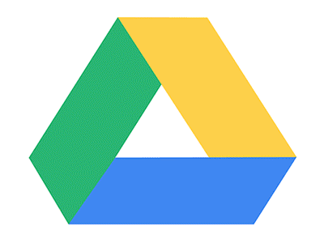

# Dulce Documentação
  

  O Dulce Documentação visa apresentar e armazenar toda a documentação referente ao sistema Dulce. Para acessar os documentos você precisa acessar nosso site [Dulce](https://dulce-work-schedule.github.io/2018.1-Dulce_App/).

### Instalação e Uso
A Instalação do App pode ser feita tanto para Android  no links a seguir.  

### Contribuir
Você quer contribuir com nosso projeto? É simples! Temos um [guia de contribuição](CONTRIBUTING.md) onde são explicados todos os passos para contribuir. Ahh, não esquece de ler nosso [código de conduta](CODE_OF_CONDUCT.md).   
Caso reste duvidas você também pode entrar em contato conosco criando uma issue ou pelo email dulce.application@gmail.com.  
Para contribuir com os microserviços acesse nossa organização:[Dulce Work Schedule](https://github.com/Dulce-Work-Schedule)

### Ambiente

Para executar o ambiente do projeto acesse nosso [guia de instalação](guia_de_instalacao.md)

Para acessar o ambiente de desenvolvimento da API acesse:  https://github.com/Dulce-Work-Schedule/

### Tecnologias Usadas no Sistema

                                      

### Colaboradores
 As informações dos [colaboradores](https://Dulce-Work-Schedule.github.io/2018.1-Dulce_App/colaboradores.html) pode ser acessada na nossa página.
